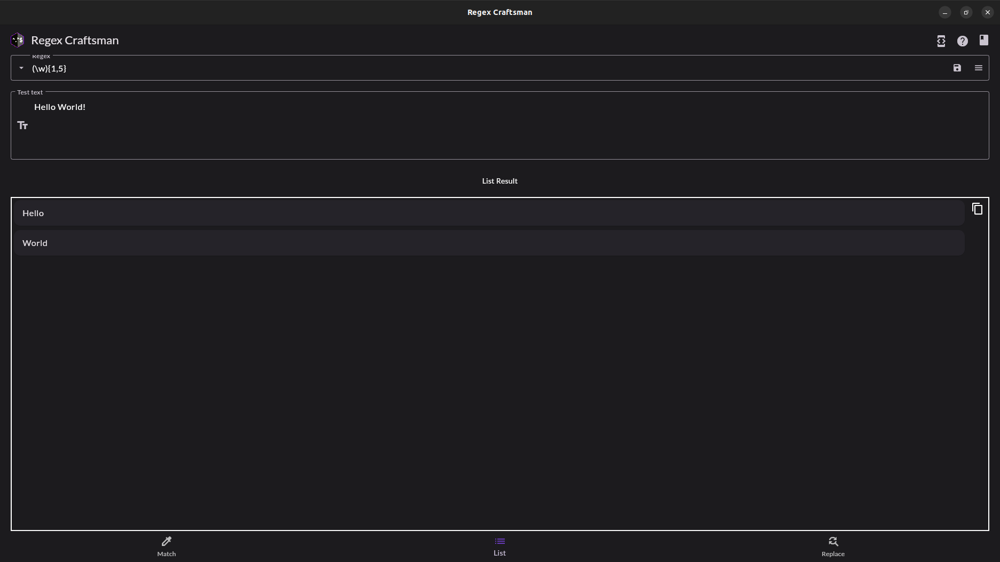

# Regex Craftsman

Tool to learn, build and test Regular Expressions (RegEx / RegExp).

Features:

- underline matches
- view matches as list
- text replace
- copy to clipboard (as CSV / JSON) text that matches
- copy to clipboard (as CSV / JSON) text that does not match

# Download from Snap Store (Ubuntu)

# Screenshots

|                 Screenshots                 |                                             |
| :-----------------------------------------: | :-----------------------------------------: |
|  |  |
|  |  |

If you found a bug, please [contact me](http://andre-i.eu/#contactme).

# Technologies

Dart + Flutter
